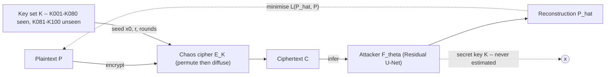

# Crynexa — Technical Feasibility Analysis

**Key-Agnostic Neural Cryptanalysis of Chaos-Based Image Encryption Under Unseen Keys**

_MSc thesis scoping document. All numbers are engineering estimates for planning, not benchmarks._

> Interactive version: <https://claude.ai/code/artifact/f63806b3-55cd-4a52-9eeb-c3c77ee9f147>

---

## Contents

- [Verdict](#verdict)
- [1. What decides whether the attack can work](#1-what-decides-whether-the-attack-can-work)
- [2. Threat model and problem statement](#2-threat-model-and-problem-statement)
- [3. Technology stack](#3-technology-stack)
- [4. Compute requirements](#4-compute-requirements)
- [5. Datasets and data pipeline](#5-datasets-and-data-pipeline)
- [6. Experimental design and evaluation](#6-experimental-design-and-evaluation)
- [7. Risk register](#7-risk-register)
- [8. Indicative timeline](#8-indicative-timeline)
- [9. Bottom line](#9-bottom-line)

---

## Verdict

| Axis | Assessment |
|---|---|
| **Overall** | **Feasible as an MSc thesis.** |
| Feasibility | Strong — in-house cipher, small models, single-GPU workload. |
| Compute | Light — one consumer GPU, or a free Kaggle / Colab tier. |
| Novelty | Incremental but defensible — unseen-key generalisation + the Key Generalisation Gap (KGG) metric. |
| Main risk | Strong diffusion ⇒ null cross-key result (manageable by framing). |

The project is feasible and unusually well-scoped for a master's thesis. The encryption is
implemented in-house, so every variable — chaotic map, key precision, round count, permutation
seed — is under the student's control. The attack models are small (5–30 M parameters), and the
whole experiment grid fits on a single consumer GPU or a free cloud tier. Prior work has already
shown that learned ciphertext-to-plaintext reconstruction is possible for chaos-based image
encryption; the contribution here is the **systematic study of generalisation to unseen keys and
configurations**, together with the KGG metric and the attack-success-versus-known-pairs curve.

The one real scientific risk is that a correctly built cipher with strong, plaintext-independent
diffusion leaves _no key-independent structure to learn_ — in which case the cross-key attack
(Experiment B) returns a chance-level result. This is manageable: treat it as a **measurement of
resistance** rather than a failure, lock the primary target to a realistic but attackable
configuration, and add a "strength knob" (rounds, chaotic-map dimensionality, key precision) so
the thesis can show where recoverability collapses. A partially negative result is still a
complete, defensible thesis.

Terminology matters for the defence: the network never recovers the key, so the work should be
described as **neural cryptanalysis / learned reconstruction**, not decryption.

---

## 1. What decides whether the attack can work

A chaos-based image cipher is normally two stages: **confusion** (pixel permutation driven by a
chaotic sequence) and **diffusion** (pixel values altered with a chaotic keystream, e.g. XOR or
modular addition, often chained). The logistic map is the usual sequence source:

```
x_{n+1} = r * x_n * (1 - x_n)      x_0 in (0,1),   r ~ 3.99      # keystream / permutation source
```

Whether a network trained on many keys can invert this for a _new_ key depends entirely on how
much of the transformation is key-independent:

- **Permutation is partly transparent.** A permutation only relocates pixels, so the global
  histogram, the exact multiset of pixel values, and — for block-wise permutation — local texture
  statistics are all preserved and identical across keys. A convolutional model can exploit
  natural-image priors to reconstruct plausible layouts from them. This is strongest at low
  resolution (32×32) and for block permutation; a full per-pixel permutation of a large image is
  close to hopeless.
- **Low-entropy keystreams leak.** Short-period or low-dimensional maps, too few diffusion rounds,
  or limited floating-point key precision shrink the _effective_ key space until the network simply
  interpolates between training keys.
- **Plaintext-coupled diffusion that leaks.** If ciphertext statistics still correlate with
  plaintext statistics, the task collapses toward image denoising, which a U-Net does well.
- **Reused or structured key schedules** across the key family give the model a shared target to
  latch onto.

When _none_ of these hold — full-image permutation plus strong, plaintext-independent,
high-entropy diffusion with adequate rounds — the unseen key's keystream carries no information
recoverable from other keys, and Experiment B should return chance-level reconstruction. Recording
exactly where that boundary sits is a legitimate thesis result.

### Two regimes

| Regime | Cipher character | What survives | Cross-key outcome |
|---|---|---|---|
| **A** | Permutation-dominant / weak diffusion | Histogram, value multiset, local texture statistics — all key-independent | **Recoverable** under unseen keys |
| **B** | Strong, plaintext-independent keystream diffusion, adequate rounds | Output is key-specific noise; nothing shared across keys | **Not recoverable** beyond a prior guess |

The feasibility of the headline experiment is a property of the target cipher, not of the network.
The thesis should locate the transition between these two regimes by weakening one parameter at a
time.

> **Design implication.** Build the primary target as a faithful logistic-map
> permutation–diffusion cipher that passes the standard security tests — entropy ≈ 7.99 bits/pixel,
> NPCR ≈ 99.61 %, UACI ≈ 33.46 %, adjacent-pixel correlation ≈ 0, near-flat histogram, key space
> > 2¹⁰⁰ — then vary one weakening parameter at a time and record where the cross-key attack starts
> to succeed. That transition curve is the thesis.

---

## 2. Threat model and problem statement

Treat the cipher as a black box `E_K`. The attacker trains an approximate inverse `F_theta` and is
judged on keys held out of training:

```
C     = E_K(P)                              # chaos cipher: key K permutes then diffuses P
P_hat = F_theta(C)                          # neural attacker; theta = weights. K never in the output
theta* = argmin_theta  E[ L( F_theta(E_K(P)), P ) ]      # over  P ~ D_train ,  K ~ K_train
evaluate F_theta*  on  K ~ K_test           # with  K_train ∩ K_test = ∅
```

**Attacker capability.** This is a known / chosen-plaintext attack with a _many-key oracle_: the
attacker can obtain arbitrary `(P, C)` pairs under many keys of their choosing, but the ciphertext
they ultimately want to read was produced with a key outside that set. This is a deliberately
strong assumption — it models a deployment with poor key management or an exposed encryption
oracle — and the thesis should state it plainly rather than imply a ciphertext-only break.

### Pipeline



Training and evaluation run through identical machinery; the only thing that changes is the key
set. Success on the unseen test keys is the evidence that the model learned key-independent
structure rather than a per-key lookup.

The three levels of generalisation map directly onto the experiment grid in section 6: same-key
(A), unseen-key (B), and unseen configuration — different chaotic map (C) or different image
distribution (D).

---

## 3. Technology stack

Everything is standard scientific Python. Nothing here is exotic or licence-encumbered, and the
whole pipeline runs offline once the raw image datasets are downloaded.

| Layer | Choice | Notes |
|---|---|---|
| Language / runtime | Python 3.10+ | Single `conda` / `venv` environment; pin with `environment.yml`. |
| DL framework | PyTorch 2.x + torchvision | Recommended. TensorFlow / Keras is a viable alternative; PyTorch makes per-batch key sampling easier. |
| Cipher & keystream | NumPy, vectorised or Numba | Logistic / Tent / Hénon maps, permutation, diffusion — implemented in-house for full control. |
| Image I/O | Pillow, OpenCV | Loading, patch extraction, colour handling. |
| Reconstruction metrics | torchmetrics, scikit-image, `lpips` | PSNR, SSIM, MS-SSIM, LPIPS. |
| Perceptual loss | torchvision VGG16 features | Feature-space term in the combined objective. |
| Dataset store | WebDataset / LMDB / HDF5, _or_ on-the-fly | On-the-fly encryption in the `DataLoader` is preferred for Experiment B (fresh key per batch). |
| Config & tracking | Hydra / OmegaConf + Weights & Biases | TensorBoard or MLflow are fine substitutes. Log the key manifest hash with every run. |
| Statistics | SciPy, pingouin, pandas | Bootstrap confidence intervals, paired tests across key folds. |
| Plotting | matplotlib, seaborn | Attack-success curves, KGG bars, transfer matrices. |
| Prototype UI (optional) | Streamlit or Gradio | The "Crynexa" front-end. Avoid a full Flask + React build for a thesis artefact. |
| Environment portability | Docker / Apptainer | Only needed if runs move to an HPC cluster. |

### Attack models to compare

- **Baseline 1** — plain CNN encoder–decoder (no skips).
- **Baseline 2** — convolutional autoencoder.
- **Proposed** — Residual U-Net; optional Attention U-Net / U-Net++ as an ablation.

Keep every model in the 5–30 M parameter range. This is an image-to-image reconstruction task at
small resolution, not a scale problem; a larger backbone mostly buys overfitting.

---

## 4. Compute requirements

The workload is small by current standards. The binding constraint is the _number_ of runs in the
grid, not the size of any single run.

| Resource | Minimum (smoke tests) | Recommended (full grid) | Free cloud |
|---|---|---|---|
| GPU | Any CUDA card ≥ 6 GB; CPU-only usable for CIFAR | RTX 3060 12 GB / 4060 Ti 16 GB / used 3090 24 GB | Kaggle 2×T4 (30 h/wk) · Colab T4 |
| System RAM | 16 GB | 32 GB | 13–30 GB provided |
| Storage | 80 GB | 250–500 GB NVMe | 60–100 GB scratch |
| One CIFAR-10 U-Net run | 2–6 h (CPU) | 30–90 min | ~1–3 h |
| Full grid (~60–120 runs) | not practical CPU-only | ~1–2 weeks on one GPU · ~1–2 days on one A100 spot | fits in a semester on free tiers |

### Throughput by dataset

- **CIFAR-10, 32×32, Residual U-Net (~10 M params), mixed precision, batch 128–256:** roughly
  2–5 k images/s on an RTX 3060/3070 ⇒ one 50 k-pair epoch in 10–30 s ⇒ a 200-epoch run in
  30–90 min. A free T4 is ~2–4× slower.
- **STL-10, 96×96:** ~5–8× slower per step; batch 64–128 fits in 8–12 GB; a few hours per run.
- **DIV2K, 128–256 patches:** batch 8–16 in 8–12 GB with mixed precision (add gradient
  checkpointing if tight); several hours to ~1 day per configuration. Patch count is a free
  parameter — you do not train on full 2K frames.
- **CPU-only:** viable for CIFAR smoke tests (epoch 5–15 min, full run 10–40 h); not practical for
  the full grid.

### Storage budget

- CIFAR-10 raw ≈ 170 MB. Pre-generated ciphertext shards ≈ 50 k images × 100 keys × 3072 bytes
  ≈ **15 GB** (uint8). On-the-fly generation ≈ 0 and is the preferred path for Experiment B.
- STL-10 ≈ 2.6 GB (unlabeled split); DIV2K ≈ 5 GB raw.
- Checkpoints 20–120 MB each; ~100 runs × a few checkpoints ≈ 20–60 GB.
- Comfortable working total: **100–250 GB**.

### Memory notes

16 GB RAM is enough for CIFAR — the entire float32 training set is ~600 MB — and 32 GB gives
headroom for `DataLoader` workers and DIV2K patch caches. VRAM of 8–12 GB is the sweet spot; 6 GB
works with smaller batches; 24 GB removes all friction. On-the-fly logistic-map keystream
generation for a 32×32×3 image is ~3072 iterations — vectorised in NumPy this is tens of thousands
of images/s per core, so it does not bottleneck the GPU; move it to a Torch tensor op if it ever
does.

---

## 5. Datasets and data pipeline

No special "encrypted image dataset" is needed — that is a strength. You start from ordinary image
datasets and generate the paired plaintext–ciphertext corpus yourself.

| Dataset | Size / resolution | Role |
|---|---|---|
| CIFAR-10 | 60,000 · 32×32 RGB | Development and the full experiment grid. Small enough to iterate in minutes. |
| STL-10 | 5k + 8k + 100k · 96×96 RGB | Cross-distribution validation — different resolution and image statistics. |
| DIV2K | 800 + 100 · 2K → 128/256 patches | High-resolution confirmatory runs only; train on random patches. |

### Split discipline

Three separations must all hold at once, or the result is not interpretable:

- **Disjoint keys** — e.g. train K001–K070, validate K071–K080, test K081–K100. Test keys never
  appear in training.
- **Disjoint plaintext images** between splits — otherwise the model can win by memorising image
  content rather than the transformation.
- **Cross-dataset test** (Experiment D) — the control that separates "learned an encryption
  weakness" from "learned natural-image priors".

### Generator

A single script produces the corpus and writes a **key manifest** (JSON): for each key, the map
type, initial condition `x_0`, parameter `r`, round count, permutation seed, and diffusion mode.
Record a content hash of the manifest and of the source image split with every training run so any
figure in the thesis can be regenerated exactly. For training, sample keys per batch from the
train manifest; for validation and test, use fixed held-out keys.

### Dataset size

From 50,000 CIFAR-10 images and 100 keys you can form up to 5,000,000 `(P, C)` pairs, but the
attack-success-curve experiment deliberately uses far fewer — the point is to measure how many
known pairs an attacker actually needs.

---

## 6. Experimental design and evaluation

| Exp | Train | Test | Question | Expected |
|---|---|---|---|---|
| A · Same-key | K001 | K001 | Can the architecture learn `E_K^-1` at all? | High PSNR/SSIM — a sanity floor. |
| B · Cross-key | K001–K070 (val K071–K080) | K081–K100 | Does it generalise to unseen keys? | The **KGG** is the headline number. |
| C · Cross-map | Logistic map | Tent / Hénon | Is the attack tied to one chaotic map? | Large drop expected. |
| D · Cross-dataset | CIFAR-10 | STL-10, DIV2K patches | Learned weakness, or learned image priors? | Separates H2 from H3. |

### Metrics

- **Reconstruction:** MSE, MAE, PSNR (dB), SSIM, LPIPS.
- **Ciphertext characterisation:** Shannon entropy (target → 8.0), adjacent-pixel correlation
  (→ 0), NPCR (→ 99.6094 %), UACI (→ 33.4635 %), histogram chi-squared. These describe the cipher;
  the neural attack measures learned recoverability — keep the two framings distinct.
- **Attack:** attack-success rate (fraction of test images with SSIM ≥ tau, e.g. tau = 0.6), the
  attack-success-versus-known-pairs curve, and the cross-map transfer matrix.

### Key Generalisation Gap

```
KGG(M) = M(seen keys) - M(unseen keys)
         e.g.  PSNR:  31.2 dB - 26.8 dB  =  4.4 dB
```

Report KGG for PSNR and SSIM. It converts "the attack still works a bit" into a single defensible
figure: how much cryptanalytic performance is lost when the attacker meets a key it has never
seen.

### Controls

- **Identity baseline** — feed the ciphertext through as the "reconstruction". This is the lower
  bound every model must clear.
- **Classical baseline** — a histogram / correlation-based statistical attack.
- **Shuffled-pair sanity check** — randomise the `(P, C)` correspondence; the model must then
  _fail_.
- **Frozen random network** — untrained weights; must also fail.

### Statistical rigour

At least 3 seeds per configuration; bootstrap 95 % confidence intervals; paired tests across key
folds; report variance, not just means. Validate the cipher _before_ attacking it — confirm it
hits the standard security targets so the thesis is attacking a properly built scheme, not a
broken one.

---

## 7. Risk register

| Risk | Impact | Mitigation |
|---|---|---|
| Strong diffusion ⇒ no cross-key signal | **High** — Experiment B returns chance-level results | Add a strength knob (rounds, map dimensionality, key precision); frame the outcome as a resistance measurement; lock the primary target to a realistic but attackable configuration. |
| Content memorisation confound | **Medium** — inflated, misleading scores | Disjoint images _and_ disjoint keys between splits, plus the cross-dataset test. |
| Threat-model realism challenged at defence | **Medium** | State the many-key chosen-plaintext assumption explicitly; discuss where it is plausible (weak key management, exposed oracle). |
| Over-claiming "decryption" | **Medium** — weakens the contribution | Terminology discipline throughout; report explicitly that the key is never recovered. |
| Compute creep on DIV2K | **Low** | Patch-based training, mixed precision; reserve high-resolution for final confirmatory runs only. |
| Scope creep for a master's timeline | **Medium** | One primary cipher, one primary dataset, one primary architecture; everything else is an ablation. |
| Reproducibility gaps | **Low** | Seeds, key manifests, dataset hashes, a container image; release the generator and training code. |

---

## 8. Indicative timeline

Roughly six months, assuming part-time work alongside coursework and access to one GPU or a free
cloud tier.

| Month | Milestone |
|---|---|
| M1 | Literature review; implement the logistic-map permutation–diffusion cipher; validate its security metrics (entropy, NPCR, UACI, correlation, histogram, key sensitivity). |
| M2 | Data pipeline and key manifests; identity and classical baselines; Experiment A (same-key sanity). |
| M3 | Experiment B (cross-key) on CIFAR-10; architecture comparison; first KGG numbers. |
| M4 | Experiments C (cross-map) and D (cross-dataset); attack-success-versus-pairs curve; strength-knob sweep. |
| M5 | STL-10 and DIV2K confirmatory runs; full security analysis; statistical tests and confidence intervals. |
| M6 | Crynexa prototype UI; write-up; reproducibility package. |

---

## 9. Bottom line

The thesis is feasible, well-scoped, compute-light, and grounded in existing literature. The
deliverables are concrete: a reproducible chaos-cipher and paired-dataset generator; a neural
cryptanalysis framework for key-independent ciphertext-to-plaintext reconstruction; an unseen-key
generalisation protocol with the KGG metric; and an empirical study of how attack effectiveness
moves with key diversity, known-plaintext volume, chaotic map, architecture, and image
distribution.

Do the development and the full grid on CIFAR-10, and only scale to STL-10 and DIV2K for
confirmatory runs. Keep scope locked to one primary scheme, one primary dataset, and one primary
architecture; treat every other combination as an ablation. Accept in advance that a properly
strong cipher may yield a chance-level cross-key result — and design the strength knob so that
outcome is itself a measured, publishable finding rather than a dead end.
